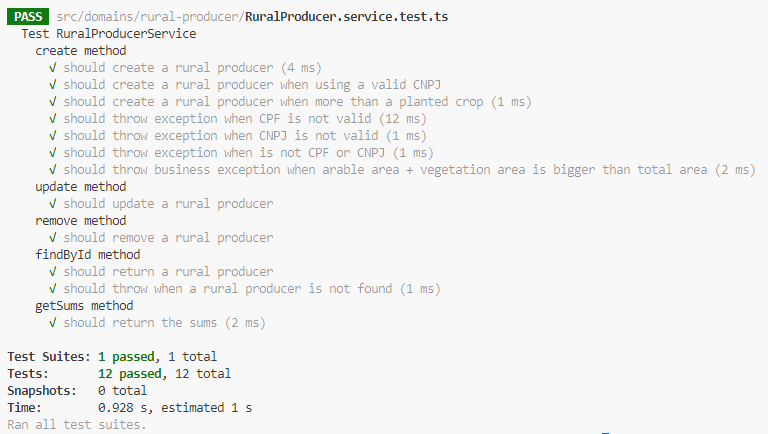

# Teste de Desenvolvimento Tinnova - Brain Agriculture

Este repositório contém o código para o teste de desenvolvimento da Tinnova para a vaga de desenvolvedor Back-end Node. Abaixo instruções para executar e outras informações importantes.

## Executar com Docker Compose

Na raiz do projeto, execute o comando `docker-compose up -d` para que seja criada a aplicação e o Postgres. Este comando já cria o schema de banco de dados.

Execute o comando `npm run prisma:seed` para popular o banco de dados com os dados mockados.

## Executar localmente em modo dev

Instale as dependências com o comando `npm i`.

Copie o arquivo `.env.example` para um arquivo de nome `.env`.

Execute o comando `npm run prisma:migrate`.

Execute a aplicação com o comando `npm run dev`.

## API Contracts

Acesse [a doc Swagger](http://localhost:3000/api-docs)  para visualizar a documentação de API.
Link [http://localhost:3000/api-docs](http://localhost:3000/api-docs).

## Testes

Execute o comando `npm run test` para executar os testes unitários.

## Sobre os requisitos de negócio e técnicos

Para o desafio, foram apresentados os seguites requisitos de negócio:

- [x] O usuário deverá ter a possibilidade de cadastrar, editar, e excluir produtores rurais.
- [x] O sistema deverá validar CPF e CNPJ digitados incorretamente.
- [x] A soma de área agrícultável e vegetação, não deverá ser maior que a área total da fazenda.
- [x] Cada produtor pode plantar mais de uma cultura em sua Fazenda.
- [x] A aplicação deve retornar somatórios para aliementar um Dashboard.

Na imagem abaixo é possível ver a suíte dos testes unitários criada para atender os requisitos acima executando sobre a layer de service (Use Case) da aplicação.

Foram utilizados os seguintes recursos e princípios conforme os requisitos técnicos:

- [x] Postgres
- [x] TypeScript
- [x] Tests
- [x] API Contracts
- [x] SOLID
- [x] KISS
- [x] Clean Code
- [x] Layered Architecture
- [x] Express

Também é importante citar alguns recursos e princípios adicionados.

- Uso do **Zod Validator** para validação dos dados se entrada da aplicação.
- Uso da lib **validations-br** para validação de CPF e CNPJ. Neste caso, usada juntamente com o **Zod Validator**.
- Uso de um repositório **in memory** `RuralProducerRepositoryInMemory.ts` para desenvolvimento inicial da layer de service e seus testes unitários, o que permite desacoplamento da camada de banco e aplicação de **TDD**.
- Uso do **PrismaORM** para criação da layer de banco de dados e conexão com o Postgres.